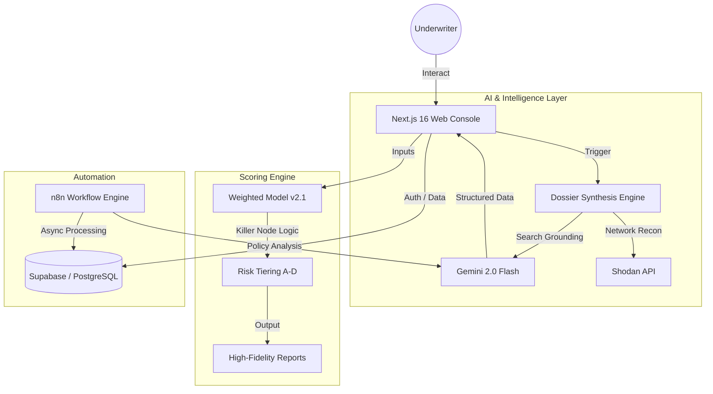

# CYRUS.PRO — Enterprise Weighted Underwriting & Risk Intelligence

<div align="center">
  
  <h3>The Forensic Standard for Cyber Risk Assessment</h3>
  <p>Next-Gen Institutional Underwriting Workstation with AI OSINT Synthesis and Weighted Risk Computation</p>
  
  [](https://nextjs.org)
  [](https://aistudio.google.com)
  [](https://shodan.io)
  []()
</div>

---

## 📖 Executive Summary

**CYRUS.PRO** is an enterprise-grade cyber risk underwriting platform designed for modern insurance institutions. It moves beyond static questionnaires by integrating **Real-time AI Intelligence** and **Forensic OSINT Reconnaissance** into the underwriting workflow.

Underwriters can generate a comprehensive digital risk dossier for any organization in seconds, then proceed to a dynamic, weighted risk assessment that computes premiums and risk tiers based on 96+ granular technical data points across 19 security domains.

---

## 🏗️ System Architecture



---

## 🧠 Core Methodology

### 1. Weighted Scoring Model (v2.1)
The system employs a **Normalized Industry Weighting** algorithm. Unlike flat models, CYRUS.PRO adjusts the "gravity" of security domains based on the client's industry profile.
*   **Industry Context**: A manufacturing firm (OT focus) has higher weight on `IoT/OT Security`, while a FinTech firm weights `Regulatory Compliance` and `IAM` more heavily.
*   **Dynamic Computation**: Scores are recalculated in real-time as the underwriter fills the assessment, providing immediate feedback on risk volatility.

### 2. The "Killer Node" Protocol
Critical security controls are marked as **Killer Nodes**. A failure in any "Killer" question triggers:
*   **Immediate Tier Capping**: The risk cannot be rated higher than "C" or "D" regardless of other high scores.
*   **Auto-Decline Logic**: Certain fatal failures (e.g., no backups, active ransomware presence) trigger a recommended "Technical Decline".
*   **Underwriting Narrative**: The system generates a specific reasoning block explaining the fatal flaw for the audit trail.

### 3. AI Dossier Synthesis
Leveraging **Gemini 2.0 Flash** with Google Search grounding, CYRUS.PRO builds a 360° view of a client:
*   **Digital Footprint**: Maps IPs, open ports (via Shodan), and exposed tech stacks.
*   **Business Context**: Identifies revenue streams, leadership, and regulatory environment (e.g., DPDP Act 2023 compliance).
*   **Threat Narrative**: Predicts specific threat actors and attack vectors likely to target that specific entity.

---

## ✨ Features Deep Dive

### 🤖 Intelligence Dossier (Client Context Docket)
*   **Zero-Input Recon**: Just enter a company name; the AI handles the rest.
*   **Quantified Risk Vectors**: 5 AI-generated scores (0-100) for Financial Stability, Digital Exposure, Supply Chain Risk, Regulatory Pressure, and Security Maturity.
*   **Asset Inventory**: Automated list of known ERPs, Cloud Providers, and critical digital assets.

### 📋 Forensic Assessment Engine
*   **19 Risk Domains**: Covering Network Security, DBR, IAM, SOC/SOAR, Dark Web Exposure, and more.
*   **96+ Weighted Questions**: Precise technical questions derived from ISO 27001, NIST, and industry best practices.
*   **Multi-Domain Progress**: Visual tracking of completion percentages across the entire audit landscape.

### 🏛️ Admin Command Center
*   **Audit Trail**: Full history of every assessment, draft, and finalized report.
*   **Role-Based Access (RBAC)**: Distinct permissions for Field Agents, Underwriters, and Senior Auditors.
*   **Data Analytics**: Recharts-powered dashboard showing industry trends and risk distribution.

### 📄 Professional Reporting
*   **High-Fidelity PDF**: Forensic-quality risk reports for institutional filing.
*   **Excel Master-File**: Technical exports for further actuarial modeling.

---

## 🛠️ Technical Stack

| Layer | Technology | Purpose |
|---|---|---|
| **Framework** | **Next.js 16 (App Router)** | Modern SSR/ISR & Edge Compatibility |
| **UI Engine** | **React 19 + Framer Motion** | High-fidelity interactive components |
| **Styling** | **Tailwind CSS v4** | Next-gen utility-first styling |
| **Database** | **Supabase (PostgreSQL)** | RLS security, Real-time sync, and Persistence |
| **AI Intelligence** | **Gemini 2.0 Flash** | Data synthesis & Search grounding |
| **OSINT** | **Shodan API** | Network reconnaissance & Port mapping |
| **Automation** | **n8n** | Asynchronous workflows & Document analysis |
| **Reporting** | **jsPDF + ExcelJS** | Multi-format institutional exports |

---

## 🚀 Setup & Installation

### Prerequisites
*   Node.js 20+ (LTS)
*   Supabase Account & Project
*   Google AI Studio API Key (Gemini)
*   Shodan API Key

### Local Development
1.  **Clone & Install**:
    ```bash
    git clone https://github.com/adityaladge/weightedunderwritingmodel.git
    cd weightedunderwritingmodel
    npm install
    ```
2.  **Environment Configuration**:
    Create `.env.local`:
    ```env
    NEXT_PUBLIC_SUPABASE_URL=your_url
    NEXT_PUBLIC_SUPABASE_ANON_KEY=your_key
    GOOGLE_GENERATIVE_AI_API_KEY=your_gemini_key
    SHODAN_API_KEY=your_shodan_key
    ```
3.  **Database Migration**:
    Execute the SQL scripts in `scripts/` or `supabase/` in your Supabase SQL Editor to set up tables and RLS policies.
4.  **Seed the Model**:
    ```bash
    npm run seed
    ```
5.  **Run**:
    ```bash
    npm run dev
    ```

---

## 🔌 API Strategy

| Endpoint | Method | Description |
|---|---|---|
| `/api/generate-dossier` | `POST` | Triggers the Gemini+Shodan synthesis pipeline |
| `/api/assessments` | `GET/POST` | Manages assessment lifecycle (Drafts & Final) |
| `/api/analyze-policy` | `POST` | AI-driven IT Policy document parsing |
| `/api/excel` | `POST` | Generates technical XLS assessment master |
| `/api/health` | `GET` | System integrity check |

---

## 🛡️ Security & Compliance
*   **Row Level Security (RLS)**: Users can only access assessments they created or are assigned to.
*   **Data Isolation**: Strict multi-tenant architecture at the database level.
*   **Audit Logging**: Every score change and draft update is timestamped.

---

## 🗺️ Roadmap
*   [ ] **API v3**: Public endpoint for partner integration.
*   [ ] **Advanced Benchmarking**: Compare risk scores against industry-wide averages.
*   [ ] **Auto-Premium Calculation**: Dynamic actuarial link for instant pricing.
*   [ ] **Multi-Document Analysis**: Analyze 5+ policy documents simultaneously.

---

## 📄 License & Credits
**Proprietary License**. All rights reserved. 
Developed by **Aditya Ladge** for **Share India Group**.

---
<div align="center">
  <sub>Built with precision for the future of cyber insurance.</sub>
</div>
